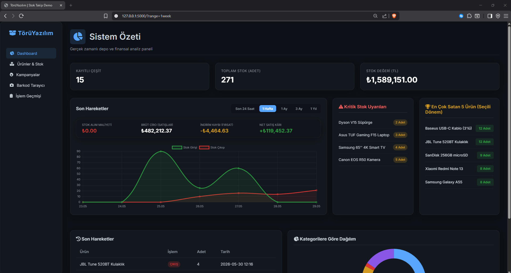
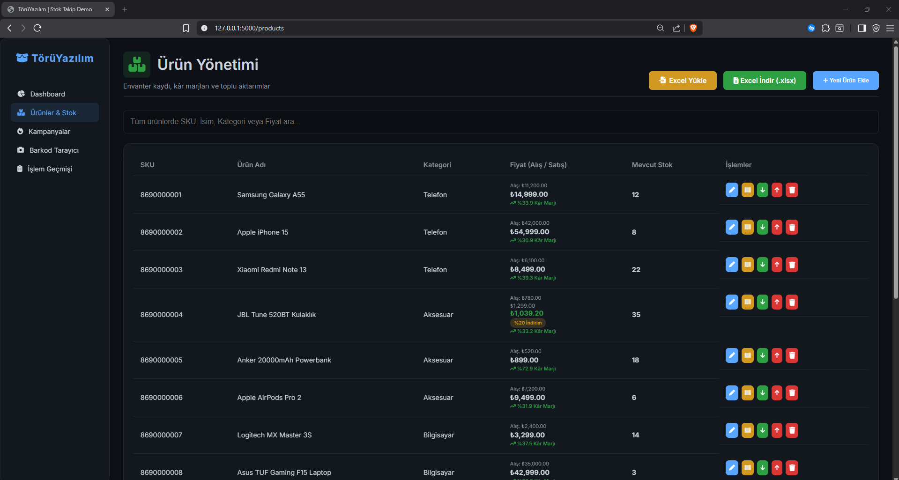
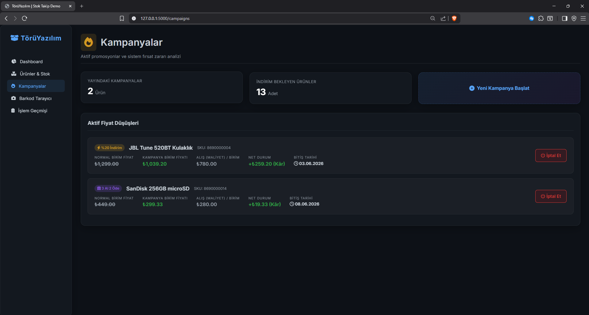
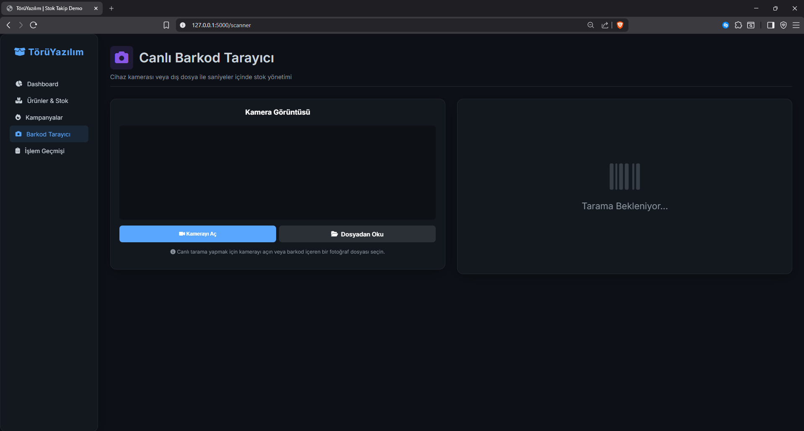
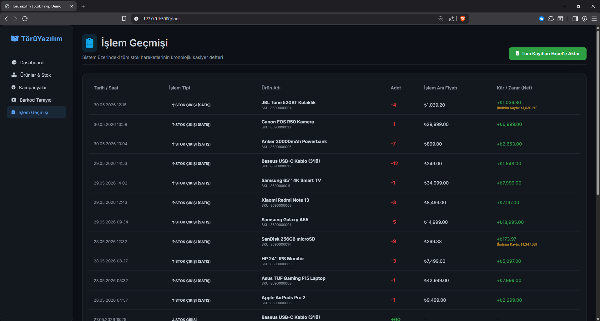

# Stok Takip ve Gelişmiş ERP Sistemi

Bu proje, orta ve küçük ölçekli işletmelerin envanter yönetim süreçlerini optimize etmek amacıyla geliştirilmiş; modern glassmorphism arayüz tasarımına, süreli kampanya/indirim motoruna ve geçmişe dönük kâr-zarar kararlılığını koruyan gelişmiş finansal snapshot mimarisine sahip hafif bir ERP uygulamasıdır.

---

## Ekran Görüntüleri

| Dashboard | Ürün Yönetimi |
| :---: | :---: |
|  |  |

| Kampanya Yönetimi | Barkod Tarayıcı |
| :---: | :---: |
|  |  |

| İşlem Geçmişi (Kasiyer Defteri) |
| :---: |
|  |

---

## Öne Çıkan Özellikler

### 1. Finansal Snapshot ve Tarihsel İşlem Geçmişi (Logs)
Sistemde gerçekleştirilen tüm stok girdi ve çıktı hareketleri (satışlar) kronolojik bir "Kasiyer Defteri" üzerinde saklanır. Stok hareketlerinin geçmiş kâr raporlarını bozmasını önlemek adına:
- Her satış işleminde, işlemin gerçekleştiği milisaniyedeki etiket fiyatı (`unit_price`), birim maliyet (`unit_purchase_price`) ve uygulanan indirimden doğan kayıp tutarı (`unit_discount_loss`) dondurularak `Transaction` tablosuna kalıcı olarak kaydedilir.
- İlgili ürünün fiyatı sonradan değiştirilse ya da tanımlanmış olan indirim kampanyası kaldırılsa bile geçmişe dönük finansal analizler ve kâr-zarar raporları kesinlikle sapma göstermez.
- Biriken tüm işlem kayıtları `openpyxl` kütüphanesi aracılığıyla tek tıkla Excel (.xlsx) formatında dışa aktarılabilir.

### 2. Gelişmiş Süreli Kampanya ve İndirim Motoru
Ürünlerin satış hacmini artırmak için entegre edilmiş esnek kampanya modülü şu özellikleri barındırır:
- **Yüzdelik İndirim:** Ürün fiyatı üzerinden belirlenen oranda (%) indirim uygulama.
- **Tutar İndirimi:** Doğrudan ürün fiyatından düşecek sabit tutarda (₺) indirim tanımlama.
- **X Al Y Öde (BOGO):** Belirli adetlerde alımlarda geçerli olacak paket indirimleri (Örn: 3 Al 2 Öde).
- Kampanyalara tanımlanan gün bazlı geçerlilik süreleri, veritabanında yerel zaman dilimine göre takip edilir ve süresi dolan kampanyalar sistem tarafından otomatik olarak devre dışı bırakılır.

### 3. Dinamik Dashboard ve Analitik Raporlama
Yönetici paneli üzerinden envanterin anlık durumunu gösteren grafiksel ve listesel göstergeler:
- **Esnek Zaman Filtresi:** Satış grafikleri "Son 24 Saat", "Son 1 Hafta", "Son 1 Ay" ve "Son 3 Ay" aralıklarında dinamik olarak filtrelenebilir (Chart.js entegrasyonu).
- **Akıllı Paneller:** İlgili zaman periyodunda en çok satan ilk 5 ürünün analizi ve stok miktarı kritik eşiğin (stok < 5) altına düşen ürünlerin acil durum uyarı listesi.
- **Kâr Marjı Göstergesi:** Her ürün için alış ve satış fiyatları üzerinden anlık yüzde (%) kâr marjı hesaplaması ve kâr/zarar durumuna göre dinamik görsel geri bildirim.

### 4. Excel ile Toplu Ürün Yükleme (Batch Import)
Sisteme tek tek ürün ekleme zahmetini ortadan kaldıran toplu aktarım özelliği:
- `SheetJS (XLSX)` kütüphanesi kullanılarak, istemci tarafında hazırlanan Excel veya CSV şablon dosyaları doğrudan tarayıcı üzerinden okunur ve arka planda çalışan API `/api/import_products` vasıtasıyla veritabanına toplu olarak güvenle aktarılır.

### 5. Canlı Barkod / QR Kod Tarama Modülü
Fiziksel depolama süreçlerini hızlandırmak amacıyla kamerayla entegre çalışan sistem:
- `html5-qrcode` kütüphanesiyle cihaz kamerası üzerinden anlık tarama desteği veya barkod fotoğrafı yükleyerek hızlı arama yapabilme.
- Okutulan barkod verisi sistemdeki bir ürünle eşleştiğinde sesli sinyal uyarısı (beep) ile onay verilerek hızlıca stok girdi/çıktı formu doldurulur.
- Tanımlanamayan barkodlarda, kullanıcının o barkod koduyla hızlıca yeni ürün oluşturabilmesi için otomatik yönlendirme sağlanır.

### 6. Barkod Oluşturucu (JsBarcode)
- Sistemdeki her ürünün SKU koduna özel standart `Code128` formatında dinamik barkod görselleri üretilir.
- Bu barkodlar ürün detay paneli üzerinden doğrudan yazdırılabilir temiz bir pencere şablonuna gönderilebilir.

### 7. Premium Glassmorphism Arayüzü
- Tamamen responsive (mobil uyumlu), modern karanlık tema (dark-mode) tabanlı ve buzlu cam (glassmorphism) efektlerine sahip özgün vanilla CSS tasarımı.
- Sayfa başlıklarında standartlaştırılmış ikonlu ve açıklayıcı şık başlık yerleşimleri.

---

## Teknik Altyapı ve Bağımlılıklar

### Backend Stack
- **Python / Flask:** Web uygulama çatısı.
- **SQLAlchemy (SQLite):** Veri tabanı ve ORM yönetim modeli.
- **openpyxl:** Python tarafında yüksek performanslı Excel (.xlsx) rapor üretimi.

### Frontend Stack
- **Chart.js:** İnteraktif grafik çizim motoru.
- **html5-qrcode:** Kamera tabanlı canlı QR/Barkod tarama kütüphanesi.
- **JsBarcode:** Ürün SKU kodlarından standart barkod görseli üretimi.
- **SheetJS (xlsx.full.min.js):** Tarayıcı tarafında Excel okuma ve veri yapılandırma.
- **FontAwesome:** Vektörel modern ikon seti.

---

## Veritabanı Şeması

### 1. `Product` (Ürünler Tablosu)
| Sütun Adı | Veri Tipi | Açıklama |
| :--- | :--- | :--- |
| `id` | Integer | Birincil Anahtar (Primary Key) |
| `sku` | String | Benzersiz Barkod / Stok Kodu |
| `name` | String | Ürün Adı |
| `category` | String | Kategori Bilgisi |
| `quantity` | Integer | Depodaki Güncel Stok Adedi |
| `price` | Float | Ana Satış Fiyatı (Etiket) |
| `purchase_price` | Float | Birim Ürün Alış Maliyeti |
| `discount_type` | String | Kampanya Türü (`PERCENT`, `AMOUNT`, `BUY_X_PAY_Y`) |
| `discount_value`| Float | İndirim Tutarı / Oranı |
| `campaign_buy_x`| Integer | X Al Y Öde Kampanyası "Alınması Gereken" Miktar |
| `campaign_pay_y`| Integer | X Al Y Öde Kampanyası "Ödenecek" Miktar |
| `discount_end_date`| DateTime | Kampanyanın Otomatik Sona Ereceği Tarih |

### 2. `Transaction` (Stok Hareketleri / Log Tablosu)
| Sütun Adı | Veri Tipi | Açıklama |
| :--- | :--- | :--- |
| `id` | Integer | Birincil Anahtar (Primary Key) |
| `product_id` | Integer | İlişkili Ürün Kimliği (Foreign Key -> Product.id) |
| `type` | String | İşlem Yönü (`IN`: Giriş, `OUT`: Satış/Çıkış) |
| `quantity` | Integer | İşlem Yapılan Adet |
| `date` | DateTime | İşlem Anındaki Yerel Zaman Damgası (+03:00) |
| `unit_price` | Float | İşlem Anındaki Birim Satış Fiyatı (Snapshot) |
| `unit_purchase_price`| Float | İşlem Anındaki Ürün Alış Maliyeti (Snapshot) |
| `unit_discount_loss` | Float | İşlem Nedeniyle Oluşan İndirim Kaybı (Snapshot) |

---

## Kurulum ve Çalıştırma

Projenin yerel makinenizde çalıştırılması için aşağıdaki adımları sırasıyla izleyebilirsiniz:

1. **Sanal Ortam (Virtual Environment) Oluşturma ve Aktifleştirme:**
   ```powershell
   python -m venv venv
   # Windows için aktifleştirme:
   .\venv\Scripts\activate
   ```

2. **Gerekli Python Kütüphanelerinin Yüklenmesi:**
   ```powershell
   pip install -r requirements.txt
   ```

3. **Veritabanı Şemasının Oluşturulması ve Başlatılması:**
   ```powershell
   python migrate_db.py
   ```

4. **Uygulamanın Başlatılması:**
   ```powershell
   python app.py
   ```
   Uygulama yerel ağınızda başlatılacaktır. Tarayıcınızdan `http://127.0.0.1:5000` adresine giderek sistemi kullanmaya başlayabilirsiniz.


